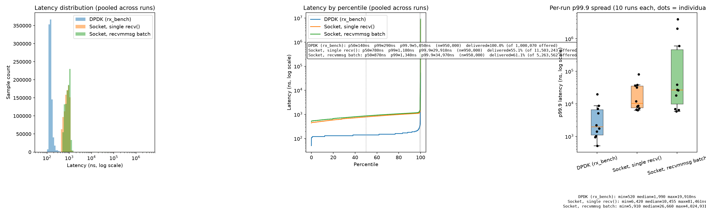

# hotpath

## Overview

## Benchmark
We are using two QEMU virtual machines to benchmark the pipeline. The first virtual machine is running PKTGEN and is writing packets
to the MAC address of the second VM. The second VM has two threads running where one thread is constantly consuming from the NIC and
pushing those packets read straight to the SPSC queue. The other thread then pops from the SPSC queue and reads the start time from
those packets to get the latency from getting the packet on the NIC to popping it from the queue and the data being usable. We use rdtsc
counter to see how many CPU cycles it takes. By taking the inverse of the counters frequency we get the time taken in seconds per cycle.
Multiplying this by 1e9 gives us the time taken in ns. There are three pipelines we are comparing. 
- The one we expect to perform the best is the DPDK kernel bypass pipeline that uses a busy polling approach to read from the NIC. It is using rte_eth_rx_burst to read batches/bursts
of packets from the NIC. These are then pushed as a batch to the SPSC ring and popped from the ring as a batch.
- The next is a simple socket based approach, that uses the recv system function to read from the socket. The single version of this
is reading from the socket one packet at a time and pushing to the ring one at a time. We then pop each item from the ring one at
a time and process it. recv under the hood is **interupt based** because it puts the thread to sleep when you call it. When data
arrives at the NIC a physical CPU interrupt triggers the OS network driver wake the thread and copy the data. 
- The last approach is the same simple socket approach, but we are trying to read from the NIC in batches similar to how rte_eth_rx_burst
reads in bursts. We then push and pop these bursts from the SPSC ring using its push/pop batch functions. 
## Benchmark Results

## Analysis
We can see here that the DPDK-based implementation clearly has the best p50 latency and tail latency. This is primarily becuause
the DPDK kernel bypass removes the overhead of the call going through the kernel stack. Meaning that when we use recv or recvmmsg
we must do the following steps:
1. Switch from userspace to kernel space
2. Kernel grabs file-descriptor for the socket from process file-descriptor table
3. Socket buffer is locked so not corrupted during read
4. Data is copied from kernel's sk_buff to user space pointer
5. Kernel cleans up (free sk_buff, unlock socket, update TCP window sizes)
6. Switch back to usermode from kernel mode
If the buffer is empty after step 3 **additionally**:
1. Thread is descheduled and removed from active run-queue
2. CPU does a full context switch 
3. The thread is woken up and rescheduled once network softirq finishes with packet
4. Resume on step 4 from above

### Packet Loss
Now when we compare the two socket based implementation's we have to note something interesting. When I first ran the numbers with
the recvmmsg implementation of the socket, I was disappointed. It consistently lagged behind the single packet recv implementation in terms
of latency, ie ~100ns on the p50. I was concerned that the batch implementation wasn't showing up as faster because there wasn't enough
traffic reach the VM (wasn't sure if there was some bottleneck somewhere between the two VM's I wasn't aware of). To fix this, I logged the packets dropped
and found that actually we were dropping around 44% of our packets. This means the problem with our batch wasn't that we weren't getting enough packets.
What I first did to lower the amount of packets being dropped, was set the SO_RCVBUFFORCE linux socket option to 8MB, so the socket is allowed to have more
data pile up before its dropped. This succeeded in slightly reducing the percentage dropped 7-8%. When we account for the packets dropped for the single recv socket
numbers we get a different story between the two implementations.

**Batched Packet Loss**

| Period | Received | Dropped  | Percent Dropped (of received + dropped) |
|---|---|----------|-----------------------------------------|
| Before 1 | 491,120 | 390,891  | 44.3%                                   |
| Before 2 | 423,800 | 323,572  | 43.3%                                   |
| Before 3 | 480,754 | 380,531  | 44.2%                                   | 
| Before Avg | — | —  | ~43.9%                                  | 
| After 1 | 304,889 | 187,412  | 38.1%                                   | 
| After 2 | 301,312 | 183,835  | 37.9%                                   |
| After 3 | 243,189 | 125,712  | 34.1%                                   | 
| After Avg | — | — | ~36.7%                                  |  

### recv() vs recvmmsg()

## Local Setup
